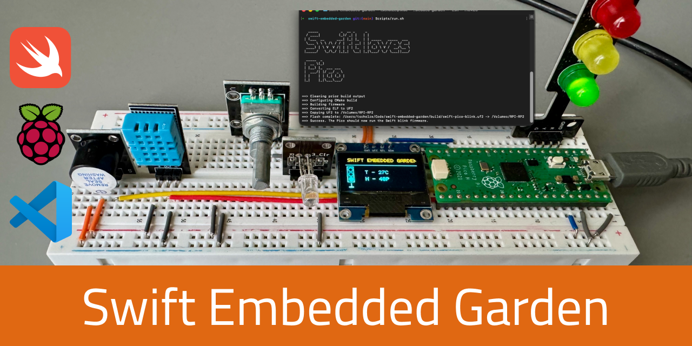
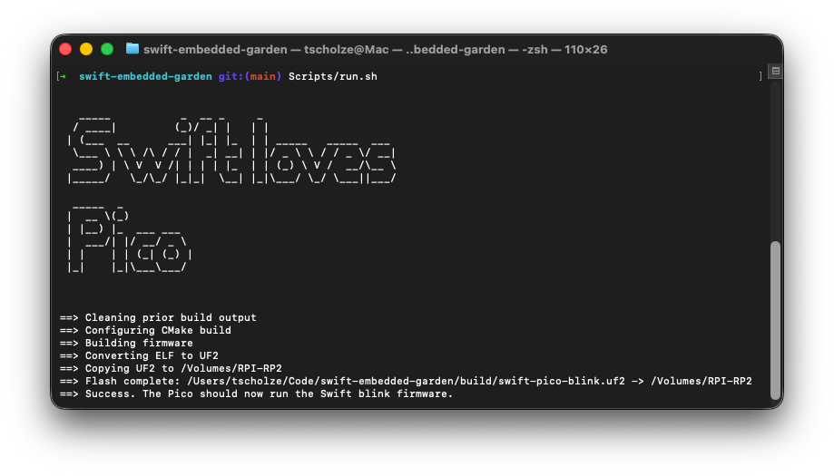

# Swift Embedded Garden for Raspberry Pi Pico (RP2040)
> This repository is a complete Swift 6 Embedded starter for the Raspberry Pi Pico, including:

- A modular Swift source layout (`Application`, `Board`, `Devices`)
- Pico C-SDK integration through CMake
- A minimal MMIO-based onboard LED blink firmware
- macOS automation scripts for setup, build, UF2 conversion, and flashing

If you are looking for the single-file-based generator to setup your own Swift embedded project for the Raspberry Pi Pico (2024), than you might be interested in my other repository [swift-embedded-garden-generator](https://github.com/tscholze/swift-embedded-garden-generator).

## CI Status

|Action|Result|
|------|------|
|run.sh|[](https://github.com/tscholze/swift-embedded-garden/actions/workflows/linux-build-no-flash.yml)|
|generator.sh|[](https://github.com/tscholze/swift-embedded-garden/actions/workflows/validate-generator.yml)|

## Samples

The repository currently includes a few small beginner-friendly samples under the application layer:

| Sample | Source file | Description |
|---|---|---|
| `GPIOSample` | `Sources/Application/Samples/GPIOSample.swift` | Configures a GPIO pin as an output, toggles the onboard LED, and demonstrates input reading with pull-up resistors. |
| `ButtonSample` | `Sources/Application/Samples/ButtonSample.swift` | Turns the onboard LED on while a button is held and off when released. |
| `BuzzerSample` | `Sources/Application/Samples/BuzzerSample.swift` | Triggers a passive buzzer on a GPIO pin at a timed interval. |
| `TrafficLightSample` | `Sources/Application/Samples/TrafficLightSample.swift` | Drives a three-LED traffic light sequence and optionally reads a KY-040 rotary encoder to select the active light. |
| `DHTS11Sample` | `Sources/Application/Samples/DHT11Sample.swift` | Reads temperature and humidity from an AZ-Delivery KY-015 DHT11 sensor over a single GPIO data line. |
| `DRV8833Sample` | `Sources/Application/Samples/DRV8833Sample.swift` | Drives a brushed DC motor with a DRV8833 dual H-bridge using PWM-based forward/reverse control and optional brake/coast behavior. |
| `DisplaySample` | `Sources/Application/Samples/DisplaySample.swift` | Initializes an Elegoo 0.96-inch SSD1306 OLED over I2C and draws text and graphics into a framebuffer. |

You can switch which sample runs by updating the entry point in `Sources/Application/Main.swift`.

## One-file project generator

The one-bash-file generator has been moved to it's own stable repository called '[swift-embedded-garden-generator](https://github.com/tscholze/swift-embedded-garden-generator)'.

## Look and feel

The script shows a simple TUI with the most important steps printed.



## Project structure

```text
.
├── CMake/
│   ├── SwiftEmbedded.cmake      # Swift object compilation helper
│   └── bootstrap.c              # C entrypoint that jumps into Swift
├── Scripts/
│   ├── init.sh                  # macOS bootstrap (toolchain + SDK + elf2uf2)
│   ├── run.sh                   # Build, convert ELF->UF2, auto-flash Pico
│   └── env.sh                   # Generated by init.sh (local environment)
├── Sources/
│   ├── Application/
│   │   └── Main.swift           # Blink loop firmware logic
│   ├── Board/
│   │   └── RP2040/
│   │       ├── MMIO.swift       # Low-level register read/write helpers
│   │       └── GPIO.swift       # RP2040 GPIO driver using MMIO
│   └── Devices/
│       ├── Button/
│       ├── RotaryButton/
│       ├── TrafficLight/
│       ├── DHT11/
│       ├── SSD1306/
│       └── DRV8833/
├── CMakeLists.txt               # Firmware build orchestration
└── Package.swift                # Swift package metadata for future dependencies
```

## Prerequisites (macOS)

- Homebrew
- USB connection to Raspberry Pi Pico

`Scripts/init.sh` installs/verifies all required host tools (`cmake`, `ninja`, `git`, `arm-none-eabi-gcc`, `swiftly`, `picotool`), provisions Swift 6 via `swiftly`, and pulls `pico-sdk`.

## Quick start

1. Initialize once:

   ```bash
   Scripts/init.sh
   ```

2. (Optional) Load generated environment:

   ```bash
   source Scripts/env.sh
   ```

   `Scripts/run.sh` auto-loads `Scripts/env.sh` when it exists, so this step is
   mainly useful when you want these variables in your current shell.

3. Put Pico into BOOTSEL mode (hold BOOTSEL while plugging in USB).

4. Build and flash:

   ```bash
   Scripts/run.sh
   ```

## Common commands

```bash
# First-time setup or SDK/toolchain refresh
Scripts/init.sh

# Build + UF2 conversion + auto-flash
Scripts/run.sh

# Build + UF2 conversion only (no board required)
Scripts/run.sh --no-flash
```

`run.sh` will:

- Configure and build the CMake firmware target
- Convert `build/swift-pico-blink.elf` to `build/swift-pico-blink.uf2` with an `elf2uf2`-compatible wrapper (backed by `picotool uf2 convert`)
- Detect the Pico mount (`/Volumes/*/INFO_UF2.TXT`)
- Copy the UF2 automatically

## Build details

- CMake links Pico SDK runtime/startup with Swift-generated object code.
- Swift sources are compiled with embedded-focused flags (see `CMake/SwiftEmbedded.cmake`).
- `CMake/bootstrap.c` calls `swift_main()` from Swift as firmware entry.
- Blink timing uses Pico SDK `sleep_ms` through a tiny C bridge so the blink
  period stays visible even under aggressive optimization.
- The shared Swift MMIO API uses a two-function volatile C boundary. This keeps
  register maps and peripheral logic in Swift while retaining the volatile
  reads and writes required by RP2040 device memory.

## GPIO sample

The `GPIOSample` demonstrates basic GPIO output and input on the RP2040.
The device is implemented in `Sources/Board/RP2040/GPIO.swift` and the sample entrypoint is `GPIOSample` in `Sources/Application/Samples/`.

### Wiring

| Signal | Raspberry Pi Pico pin |
| --- | --- |
| Onboard LED | GP25 (built-in) |
| Example input | GP15 |

### Feature highlights

- Configure a GPIO pin as a CPU-controlled output and toggle it high/low.
- Configure a GPIO pin as an input and enable the internal pull-up resistor.
- Read the current level of an input pin to detect external signals.

## Button sample

The `ButtonSample` turns the onboard LED on while a button is held and off when released.
The device is implemented as `Button` in `Sources/Devices/Button/` and the sample entrypoint is `ButtonSample` in `Sources/Application/Samples/`.

### Wiring

| Signal | Raspberry Pi Pico pin |
| --- | --- |
| Onboard LED | GP25 (built-in) |
| Button signal | GP16 |

Connect the KY-004 button module or a bare momentary switch between the signal pin and VCC (active-high) or GND (active-low), adjusting `isActiveHigh` accordingly.

### Feature highlights

- `isPressed()` for real-time level reading.
- `wasPressed()` for edge-triggered (press-once) detection.
- Configurable active-high or active-low polarity.

## Buzzer sample

The `BuzzerSample` triggers a passive buzzer on a GPIO pin at a timed interval.
The device is implemented as `Buzzer` in `Sources/Devices/Buzzer/` and the sample entrypoint is `BuzzerSample` in `Sources/Application/Samples/`.

### Wiring

| Signal | Raspberry Pi Pico pin |
| --- | --- |
| Buzzer signal | GP28 |
| VCC | 3V3(OUT) |
| GND | GND |

### Feature highlights

- Drive a passive buzzer with a configurable GPIO pin.
- Controllable buzz duration via `buzz(durationMs:)`.
- Repeating buzz pattern with configurable inter-buzz delay.

## Traffic light sample

The `TrafficLightSample` cycles through a red/yellow/green LED sequence and optionally uses a KY-040 rotary encoder to manually select the active light.
The device is implemented as `TrafficLight` in `Sources/Devices/TrafficLight/` and the sample entrypoint is `TrafficLightSample` in `Sources/Application/Samples/`.

### Wiring

| Signal | Raspberry Pi Pico pin |
| --- | --- |
| Red LED | Configurable via `TrafficLightConfiguration` |
| Yellow LED | Configurable via `TrafficLightConfiguration` |
| Green LED | Configurable via `TrafficLightConfiguration` |
| KY-040 DT (optional) | GP14 |
| KY-040 CLK (optional) | GP15 |
| KY-040 SW (optional) | GP13 |

### Feature highlights

- Automatic timed red/yellow/green cycle.
- Optional KY-040 rotary encoder input to manually select the active light.
- Cycle indicator blink before each state change.

## DHT11 sensor sample

The `DHTS11Sample` reads temperature and humidity from an AZ-Delivery KY-015 DHT11 sensor.
The device is implemented as `DHT11` in `Sources/Devices/DHT11/` and the sample entrypoint is `DHTS11Sample` in `Sources/Application/Samples/DHT11Sample.swift`.

### Wiring

| Signal | Raspberry Pi Pico pin |
| --- | --- |
| DATA | GP2, GP3, GP15, or GP22 |
| VCC | 3V3(OUT) |
| GND | GND |

GP0/GP1 are not recommended (USB), GP4/GP5 are default I2C pins, and GP6–GP11 are tied to the onboard QSPI flash. GP2 and GP3 are the simplest verified choices.

### Feature highlights

- One-wire DHT11 bit-bang protocol over a single GPIO data line.
- Returns temperature in °C and relative humidity in % per reading.
- LED success/failure indicator: one brief pulse on success, three rapid pulses on failure.
- 2-second cooldown enforced between readings as required by the DHT11 datasheet.

## DRV8833 motor sample

The `DRV8833Sample` drives a brushed DC motor forward, reverse, and stopped using a DRV8833 dual H-bridge.
The device is implemented as `DRV8833` in `Sources/Devices/DRV8833/` and the sample entrypoint is `DRV8833Sample` in `Sources/Application/Samples/`.

### Wiring

| Signal | Raspberry Pi Pico pin |
| --- | --- |
| AIN1 | GP14 |
| AIN2 | GP15 |
| BIN1 | GP8 |
| BIN2 | GP9 |
| nSLEEP (optional) | not connected by default |

Connect the DRV8833 VM pin to the motor supply, VCC to 3.3V logic, GND to Pico ground, and motor terminals to AOUT1/AOUT2 or BOUT1/BOUT2.

### Feature highlights

- Signed speed control from `-100` to `100` for forward and reverse motion.
- PWM-based motor drive using the RP2040 PWM peripheral.
- Optional brake and coast stop modes.
- Support for an optional `nSLEEP` pin to wake the H-bridge before driving.

## SSD1306 OLED display sample

The `DisplaySample` initializes an Elegoo 0.96-inch 128x64 SSD1306 OLED over I2C and renders text and graphics into a 1,024-byte framebuffer.
The device is implemented as `SSD1306Driver` in `Sources/Devices/SSD1306/` and the sample entrypoint is `DisplaySample` in `Sources/Application/Samples/`.

### Wiring

| OLED pin | Raspberry Pi Pico pin |
| --- | --- |
| VCC | 3V3(OUT) |
| GND | GND |
| SDA | GP4 |
| SCL | GP5 |

### Feature highlights

- Automatic I2C address detection: tries `0x3C` first, then retries at `0x3D`.
- `SwiftGFX` framebuffer with text, line, and shape primitives.
- Drawing accumulates in RAM; call `flush()` to transfer to the display.
- LED fault indicator: one blink on initialization failure, two blinks on flush failure.

## Extending with drivers (GPIO, UART, I2C, SPI)

Recommended layering:

1. **Board layer (`Sources/Board`)**
   Add board-specific register definitions and primitives here:
   - `I2C.swift`
   - `GPIO.swift`
   - `PWM.swift`

2. **Device layer (`Sources/Devices`)**
   Keep hardware-specific drivers and their local helpers here:
   - `SSD1306/`
   - `RotaryButton/`
   - `DHT11/`

3. **Application layer (`Sources/Application`)**
   Use high-level driver calls without direct register addresses.

When adding new Swift files, include them in `CMakeLists.txt` under `SWIFT_SOURCES`.

## Dependency extension with Package.swift

`Package.swift` is preconfigured so you can add additional Swift Embedded dependencies later by uncommenting and adjusting the example dependency blocks.

## Troubleshooting

- **`PICO_SDK_PATH is not set`**  
  Run `Scripts/init.sh`. If needed, `source Scripts/env.sh`.

- **No Pico mount detected**  
  Reconnect the board in BOOTSEL mode and check for `INFO_UF2.TXT` under `/Volumes`.

- **`cp ... could not copy extended attributes ... Operation not permitted`**  
  This is handled in `Scripts/run.sh` by using `cp -X` for UF2 copy.

- **`swiftc` not found or wrong version**  
  Re-run `Scripts/init.sh`; it will provision Swift via `swiftly`.

- **Build-only validation without hardware connected**  
  Use `Scripts/run.sh --no-flash`.

## Thanks to

- The 'Embedded' channel on the [Swift Discord](https://discord.gg/3v9kNvSBd)
- The 'Embedded' section on the [Swift Forum](https://forums.swift.org/c/platform/embedded/107)
- More or less good working GitHub Copilot

## Formatting

Currently there is no special formatting, before commiting it should be formatted via:
```bash
 find . -name "*.swift" -not -path "./.build/*" -print0 | xargs -0 swift format format --in-place
 ```

## License

This project is licensed under the MIT License - see the [LICENSE](LICENSE) file for details.

Dependencies or assets maybe licensed differently.
